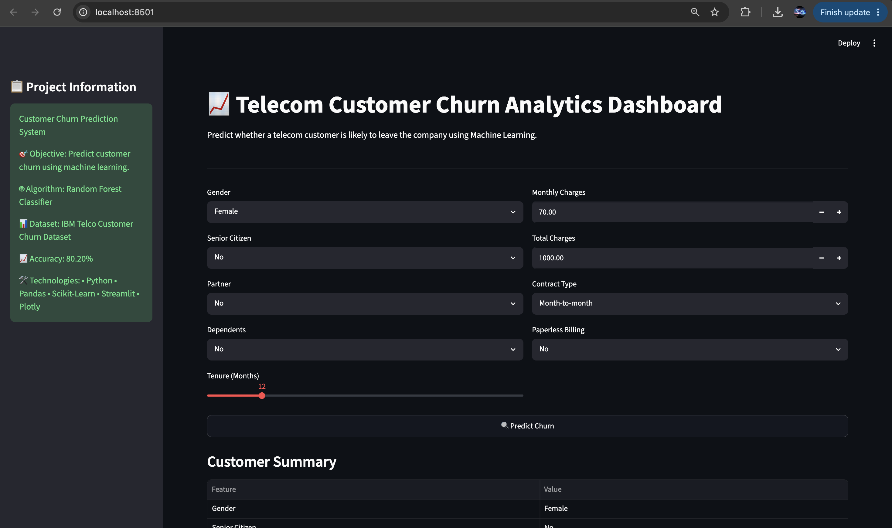
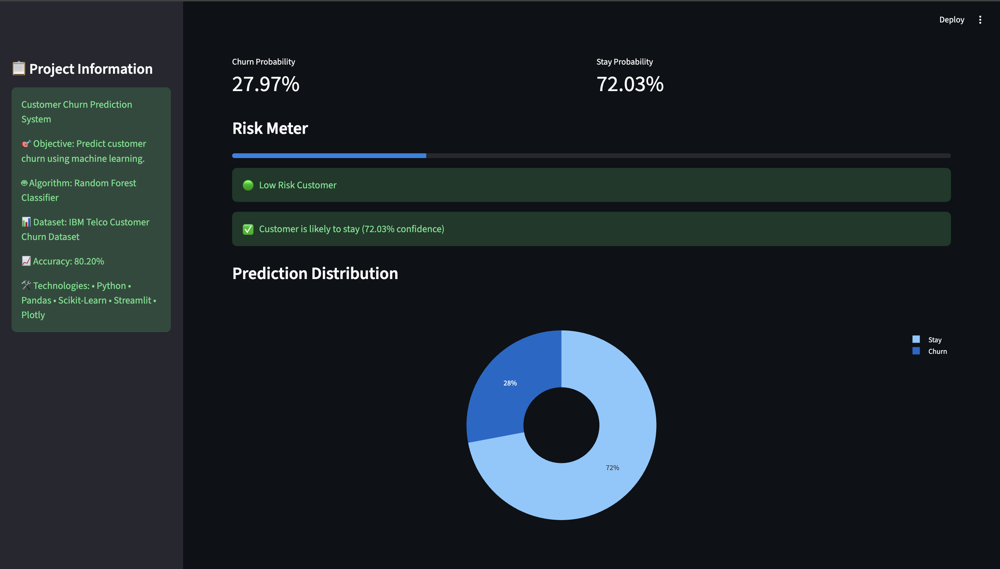
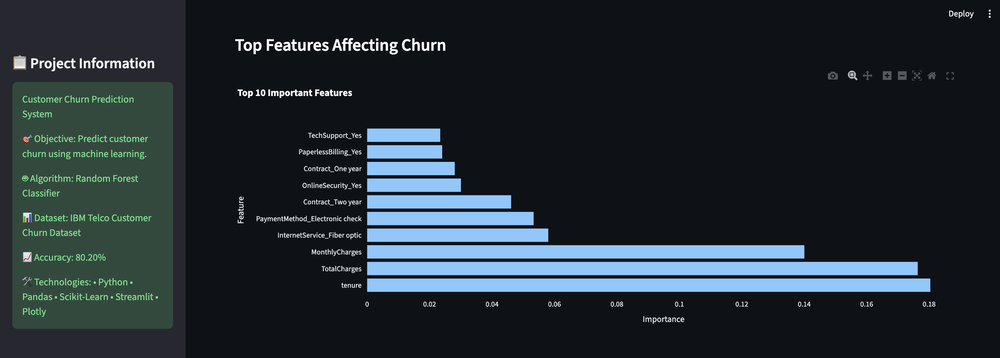
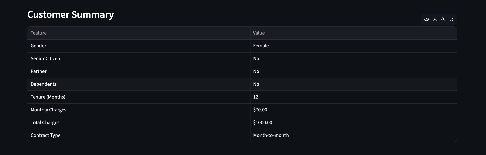

# 📊 Customer Churn Prediction System

A Machine Learning-powered web application that predicts whether a telecom customer is likely to churn (leave the company) based on customer demographics, account information, and service usage patterns.

Built using **Python**, **Scikit-Learn**, **Streamlit**, and **Plotly**.

---

## 🚀 Project Overview

Customer churn is a major challenge for telecom companies. Retaining existing customers is often more cost-effective than acquiring new ones.

This project uses the **IBM Telco Customer Churn Dataset** and a **Random Forest Classifier** to predict customer churn and provide actionable insights through an interactive dashboard.

---

## 🎯 Objectives

- Predict customer churn using Machine Learning
- Analyze important factors affecting churn
- Provide an interactive dashboard for business insights
- Visualize churn probability and customer risk levels

---

## 🛠️ Technologies Used

- Python
- Pandas
- NumPy
- Scikit-Learn
- Streamlit
- Plotly
- Joblib

---

## 📂 Dataset

Dataset Used:

**IBM Telco Customer Churn Dataset**

Dataset contains:

- 7043 customer records
- 30 engineered features
- Customer demographics
- Account information
- Service subscriptions
- Churn status

---

## 🤖 Machine Learning Model

Algorithm Used:

**Random Forest Classifier**

### Model Performance

| Metric | Value |
|----------|----------|
| Accuracy | 80.20% |
| Dataset Size | 7043 Records |
| Features | 30 |
| Test Size | 20% |

---

## 📈 Top Factors Affecting Churn

According to the trained model:

1. Tenure
2. Total Charges
3. Monthly Charges
4. Internet Service (Fiber Optic)
5. Payment Method
6. Contract Type
7. Online Security
8. Tech Support
9. Paperless Billing
10. Gender

---

## ✨ Features

✅ Customer Churn Prediction

✅ Risk Assessment Meter

✅ Churn Probability Score

✅ Stay Probability Score

✅ Interactive Dashboard

✅ Feature Importance Visualization

✅ Customer Summary Analytics

✅ Professional UI using Streamlit

---

## 📸 Screenshots

### Dashboard Overview



### Prediction Results



### Analytics Dashboard



### Risk Assessment



---

## 📁 Project Structure

```text
customer-churn-prediction/
│
├── data/
│   └── WA_Fn-UseC_-Telco-Customer-Churn.csv
│
├── models/
│   ├── churn_model.pkl
│   ├── feature_columns.pkl
│   └── feature_importance.csv
│
├── images/
│   ├── dashboard1.png
│   ├── dashboard2.png
│   ├── dashboard3.png
│   └── dashboard4.png
│
├── app.py
├── train.py
├── requirements.txt
├── README.md
└── .gitignore
```

---

## ⚙️ Installation

Clone the repository:

```bash
git clone https://github.com/kotankartaran/customer-churn-prediction.git
```

Move into project folder:

```bash
cd customer-churn-prediction
```

Create virtual environment:

```bash
python -m venv venv
```

Activate virtual environment:

### macOS/Linux

```bash
source venv/bin/activate
```

### Windows

```bash
venv\Scripts\activate
```

Install dependencies:

```bash
pip install -r requirements.txt
```

---

## ▶️ Train the Model

```bash
python train.py
```

Output:

```text
Model Accuracy: 80.20%
Model saved successfully!
Feature importance saved!
```

---

## ▶️ Run the Dashboard

```bash
streamlit run app.py
```

Application will start at:

```text
http://localhost:8501
```

---

## 📊 Dashboard Features

The dashboard allows users to:

- Enter customer details
- Predict churn probability
- View risk level
- Visualize prediction distribution
- Analyze important features
- Review customer summary

---

## 🔮 Future Improvements

- XGBoost Implementation
- Hyperparameter Tuning
- Deep Learning Models
- Customer Segmentation
- Deployment on Streamlit Cloud
- Real-Time Database Integration
- Explainable AI (SHAP)

---

## 👨‍💻 Author

**Taran Kotankar**

GitHub:
https://github.com/kotankartaran

---

## ⭐ Support

If you found this project useful, please consider giving it a ⭐ on GitHub.

It helps others discover the project and motivates further improvements.